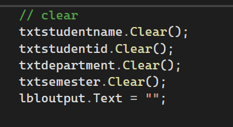

# Introduction
The following image shows the code used in this chapter. In this section, we will discuss the main purpose of the code, explain how it works, and describe the important parts of the program.

# Student Information Code
This code is used to collect student information from TextBox controls and display the information in a Label.

# Creating Variables
String studentname, department;
int studentid, semester;
These variables are created to store the student's name, student ID, department, and semester.
String stores text values.
int stores whole numbers.

# Reading Student Name
studentname = txtstudentname.Text;
This gets the student name entered in the txtstudentname TextBox and stores it in the studentname variable.

# Reading Student ID
studentid = int.Parse(txtstudentid.Text);
This gets the student ID from the TextBox and converts the entered text into an integer using int.Parse().

# Reading Department
department = txtdepartment.Text;
This gets the department entered by the user and stores it in the department variable.

# Reading Semester
semester = int.Parse(txtsemester.Text);
This gets the semester from the TextBox and converts the entered text into an integer.

# Displaying the Information
lbloutput.Text = studentname + " " + studentid + " " + department + " " + semester;
This combines all the student information and displays it in the lbloutput Label.

# Introduction

The following image shows the code used to clear the student information form. In this section, we will explain how the code removes the entered information from the TextBox controls and clears the output Label.

# Clear Button Code

This code is used to clear all the information entered by the user and reset the form.

# Clear Student Name

txtstudentname.Clear();

This removes the student name entered in the "txtstudentname" TextBox.

# Clear Student ID

txtstudentid.Clear();

This removes the student ID entered in the "txtstudentid" TextBox.

# Clear Department

txtdepartment.Clear();

This removes the department entered in the "txtdepartment" TextBox.

# Clear Semester

txtsemester.Clear();

This removes the semester entered in the "txtsemester" TextBox.

# Clear Output

lbloutput.Text = "";

This removes the information displayed in the "lbloutput" Label by setting its text to an empty value.

# Summary

The code resets the form by clearing all TextBox controls and removing the displayed output. It allows the user to enter new information from the beginning.

# Introduction

The following image shows the code used to close the Windows Forms application. In this section, we will explain the purpose of the code and how it works.

# Exit Button Code

this.Close();

The "this.Close();" statement closes the current Windows Form.

- "this" refers to the current form.
- "Close()" is a method used to close the form.

# Summary

This code is commonly used with an Exit button to allow the user to close the current application window.
