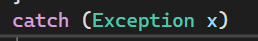

# WEEK2 CODES README
# CODE ONE PICTURE

This code demonstrates how to read data from TextBox controls, convert numeric input into the correct data types, store the values in variables, and display the results in a Label. It also uses a try block to handle possible input errors.

# Code Explanation – Processing Data

This code reads age, salary, and grade from TextBox controls, stores them in variables, and displays the values in a Label.

# Creating Variables

int age;
double salary;
String grade;

- "int age" stores a whole number.
- "double salary" stores a decimal number.
- "String grade" stores text.

# Using try

try
{
    ...
}

The "try" block contains code that may produce an input error. For example, if the user enters text instead of a number for age, an error can occur.

# Reading Age

age = int.Parse(txtage.Text);

This gets the value from "txtage" and converts it from text into an integer.

# Reading Salary

salary = double.Parse(txtsalery.Text);

This gets the value from "txtsalery" and converts it from text into a "double".

# Reading Grade

grade = txtgrade.Text;

This gets the text entered in the grade TextBox and stores it in the "grade" variable.

# Concatenation and Output

lbloutput.Text = age + " " + salary + " " + grade;

This combines the three values and displays them in the "lbloutput" Label.

# Summary

# The code demonstrates:

- Variables
- TextBox input
- Data type conversion
- "int.Parse()"
- "double.Parse()"
- String data
- "try" block
- Concatenation
- Label output

# catch (Exception x) 
catch(exception x) is used to catch and handle errors that may occur inside the try block. Instead of allowing the program to stop, it can display an error message to the user.

# how try and catch solve this problem
The try-catch statement is used to handle errors without stopping the program.

In the screenshot, the user entered salah in the Age TextBox. Since int.Parse() expects a number, an error occurred.

In the example shown in the screenshot, the program expects the Age input to be a number.
Try Block
try
{
    age = int.Parse(txtage.Text);
}
The try block contains code that may cause an error. Here, int.Parse() tries to convert the Age input into an integer.
Catch Block
catch (Exception x)
{
    MessageBox.Show(x.Message);
}
If an error occurs inside try, the catch block catches it and displays the error message.
# Example from the Screenshot
The user entered:
Age: salah
But int.Parse() requires a number, such as:
Age: 20
Therefore, the program displays:
Input string was not in a correct format.
Benefits of try-catch
Handles incorrect user input.
Prevents the application from crashing.
Displays a clear error message.
Makes the program more reliable and user-friendly.
# Summary
try → attempts to run the code.
catch → handles the error if one occurs.
